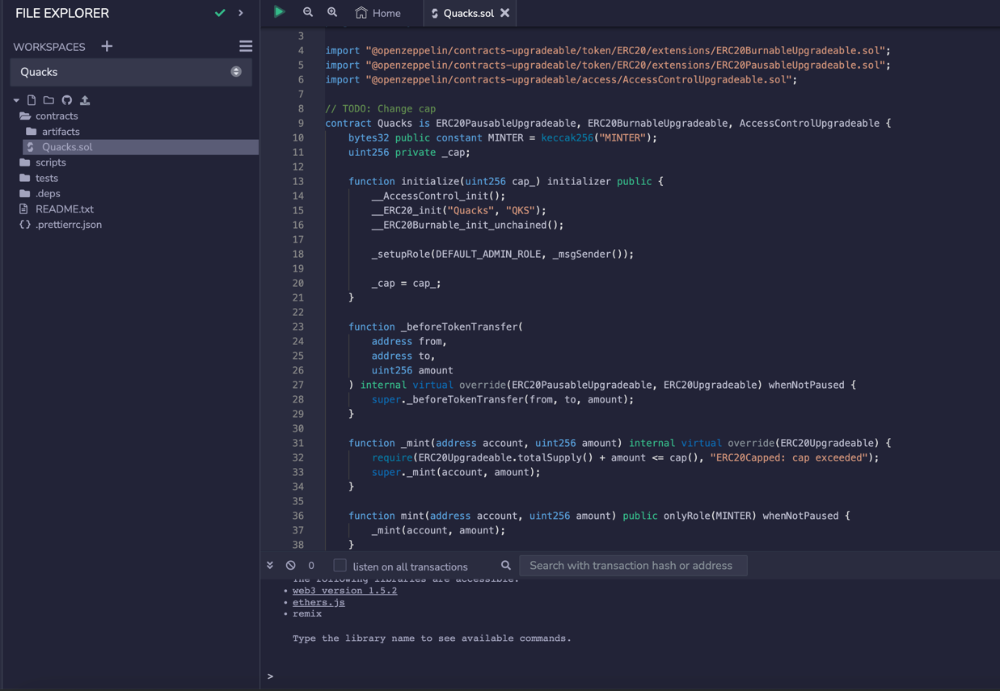
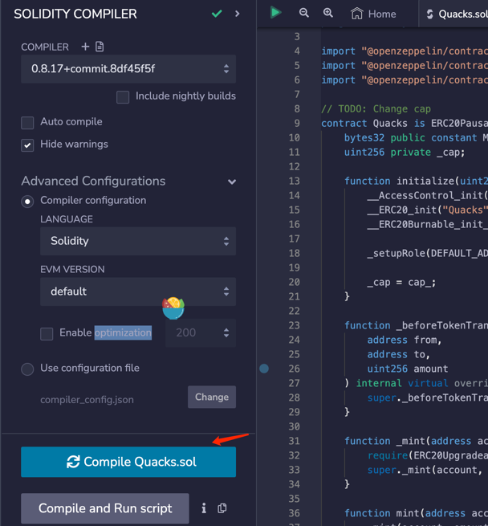
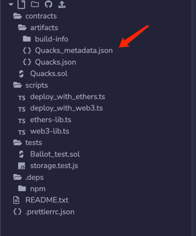
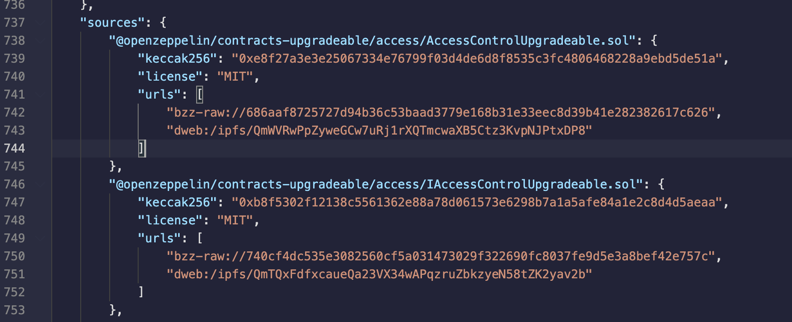

Let's take https://crab.subscan.io/account/0x5ac20c18d7f8ba3ed5e77e468460e980a05e4c3c?tab=contract as an example

Suppose we are compiling and deploying in [remix](https://remix.ethereum.org/)


1. Upload (or edit) the code to remix,pay attention to the relative path of the file



2. Set the compiler version, and evm version, optimization, and click compile Quacks.sol




3. After compiling the contract, check the source code to see that a new file is generated, ``Quacks_metadata.json``,




4. Due to the lack of source code, this Quacks_metadata.json cannot be used directly and needs some modification.



5.Use multiple literal {"content": "", ...} for multi part contracts containing multiple source files

```json
{
  "sources": {
    "@openzeppelin/contracts-upgradeable/access/AccessControlUpgradeable.sol": {
      "keccak256": "0xe8f27a3e3e25067334e76799f03d4de6d8f8535c3fc4806468228a9ebd5de51a",
      "license": "MIT",
      "content": "// SPDX-License-Identifier: MIT\n// OpenZeppelin Contracts (last updated v4.8.0) (access/AccessControl.....\n",
      "urls": [
        "bzz-raw://686aaf8725727d94b36c53baad3779e168b31e33eec8d39b41e282382617c626",
        "dweb:/ipfs/QmWVRwPpZyweGCw7uRj1rXQTmcwaXB5Ctz3KvpNJPtxDP8"
      ]
    }
  }
}
```

6. Now you can upload the modified Standard-Input-JSON.json

7. If you have any questions, you can refer to [compiler-input-and-output-json-description](https://docs.soliditylang.org/en/v0.5.8/using-the-compiler.html#compiler-input-and-output-json-description)
